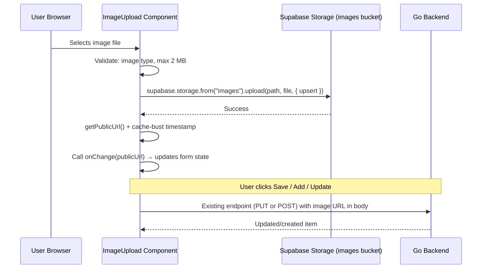

# Image Uploads via Supabase Storage

## Current State

- Four forms currently use plain text `<Input>` fields for image URLs:
  - **Profile** — `image` field in `profile-form.tsx` (line 154-158, "Profile image URL")
  - **Projects** — `image` field in `projects-form.tsx` (line 155-161, "Image URL")
  - **Education** — `universityImage` field in `education-form.tsx` (line 158-164, "University image URL")
  - **Experience** — `companyImage` field in `experience-form.tsx` (line 214-220, "Company image URL")
- The `resumes` bucket and `ui/lib/storage.ts` already handle PDF uploads with the same client-side direct upload pattern
- Supabase client is configured at `ui/lib/supabase/client.ts`

## Architecture: Single Bucket, Folder-Based Organization

All images go into **one bucket** called `images`. Folders separate the use cases. This is simpler than multiple buckets (one set of RLS policies, one bucket to manage) and Supabase's RLS policies can scope access by folder path just as easily.

```
images/
  {userId}/
    profile.{ext}                   ← profile photo (one per user, upsert)
    projects/{identifier}.{ext}     ← project cover images
    education/{identifier}.{ext}    ← university logos
    experience/{identifier}.{ext}   ← company logos
```

- **Profile**: fixed filename `profile.{ext}` — upsert overwrites, so each user only has one profile photo.
- **Projects / Education / Experience**: each upload uses a random short ID for the filename (e.g. `a1b2c3d4.png`). Since the full public URL is stored in the backend, the filename doesn't need to match the backend item ID. This handles both create (no item ID yet) and edit uniformly.



## Step 1: Create Supabase Storage Bucket + RLS Policies

Run in the Supabase Dashboard SQL editor (once):

```sql
-- Create a public bucket for images
INSERT INTO storage.buckets (id, name, public, file_size_limit, allowed_mime_types)
VALUES (
  'images',
  'images',
  true,
  2097152,  -- 2 MB
  ARRAY['image/jpeg', 'image/png', 'image/webp', 'image/gif']
);

-- Allow authenticated users to upload to their own folder
CREATE POLICY "Users can upload their own images"
ON storage.objects FOR INSERT TO authenticated
WITH CHECK (
  bucket_id = 'images'
  AND (storage.foldername(name))[1] = (SELECT auth.jwt()->>'sub')
);

-- Allow authenticated users to update/overwrite their own images
CREATE POLICY "Users can update their own images"
ON storage.objects FOR UPDATE TO authenticated
USING (
  bucket_id = 'images'
  AND (storage.foldername(name))[1] = (SELECT auth.jwt()->>'sub')
);

-- Allow authenticated users to delete their own images
CREATE POLICY "Users can delete their own images"
ON storage.objects FOR DELETE TO authenticated
USING (
  bucket_id = 'images'
  AND (storage.foldername(name))[1] = (SELECT auth.jwt()->>'sub')
);

-- Allow public read access
CREATE POLICY "Public read access for images"
ON storage.objects FOR SELECT TO public
USING (bucket_id = 'images');
```

Bucket-level constraints enforce the 2 MB limit and allowed MIME types, so even if client validation is bypassed, Supabase rejects bad uploads.

## Step 2: Add Image Storage Helpers — `ui/lib/storage.ts`

Add alongside the existing resume helpers in the same file.

### Constants

```typescript
const IMAGES_BUCKET = "images";
const MAX_IMAGE_SIZE = 2 * 1024 * 1024; // 2 MB
const ALLOWED_IMAGE_TYPES = ["image/jpeg", "image/png", "image/webp", "image/gif"];
```

### `validateImageFile(file: File): void`

Throws a user-friendly error if the file isn't an allowed image type or exceeds 2 MB.

```typescript
export function validateImageFile(file: File): void {
  if (!ALLOWED_IMAGE_TYPES.includes(file.type)) {
    throw new Error("Only JPEG, PNG, WebP, and GIF images are allowed.");
  }
  if (file.size > MAX_IMAGE_SIZE) {
    throw new Error("Image must be under 2 MB.");
  }
}
```

### `getFileExtension(file: File): string`

Returns the extension from the MIME type (e.g. `image/png` → `png`). Used to build the storage path.

```typescript
function getFileExtension(file: File): string {
  const map: Record<string, string> = {
    "image/jpeg": "jpg",
    "image/png": "png",
    "image/webp": "webp",
    "image/gif": "gif",
  };
  return map[file.type] ?? "jpg";
}
```

### `uploadImage(userId, category, file, filename?): Promise<string>`

Generic upload function. `category` determines the subfolder. `filename` is optional — if omitted, a random ID is generated (via `crypto.randomUUID().slice(0, 8)`).

```typescript
export type ImageCategory = "profile" | "projects" | "education" | "experience";

export async function uploadImage(
  userId: string,
  category: ImageCategory,
  file: File,
  filename?: string,
): Promise<string> {
  const supabase = createClient();
  const ext = getFileExtension(file);
  const name = filename ?? crypto.randomUUID().slice(0, 8);
  const filePath =
    category === "profile"
      ? `${userId}/profile.${ext}`
      : `${userId}/${category}/${name}.${ext}`;

  const { error } = await supabase.storage
    .from(IMAGES_BUCKET)
    .upload(filePath, file, {
      upsert: true,
      contentType: file.type,
    });

  if (error) throw new Error(`Upload failed: ${error.message}`);

  const { data } = supabase.storage.from(IMAGES_BUCKET).getPublicUrl(filePath);
  return `${data.publicUrl}?t=${Date.now()}`;
}
```

For profile, the path is always `{userId}/profile.{ext}` so upsert naturally overwrites. For the other categories, each upload gets a unique filename.

### `deleteImage(imageUrl: string): Promise<void>`

Parses the storage path from a public URL and deletes the file. Works for any image regardless of category.

```typescript
export async function deleteImage(imageUrl: string): Promise<void> {
  const supabase = createClient();

  // Public URL format: {supabaseUrl}/storage/v1/object/public/images/{path}
  // Strip query params, then extract everything after "/images/"
  const cleanUrl = imageUrl.split("?")[0];
  const marker = `/storage/v1/object/public/${IMAGES_BUCKET}/`;
  const idx = cleanUrl.indexOf(marker);
  if (idx === -1) return; // not a storage URL, nothing to delete

  const filePath = cleanUrl.slice(idx + marker.length);

  const { error } = await supabase.storage
    .from(IMAGES_BUCKET)
    .remove([filePath]);

  if (error) throw new Error(`Delete failed: ${error.message}`);
}
```

This approach means callers don't need to know the category or reconstruct the path — just pass the URL that was stored in the form/backend.

## Step 3: Create Reusable `ImageUpload` Component — `ui/components/shared/image-upload.tsx`

A single `"use client"` component used by all four forms. Replaces the plain text `<Input>` fields.

### Props

```typescript
interface ImageUploadProps {
  value: string;                    // current image URL from form state (or "")
  onChange: (url: string) => void;  // called with new URL on upload, "" on remove
  userId: string;
  category: ImageCategory;
  label?: string;                   // e.g. "Profile photo", "Cover image"
  className?: string;
}
```

### Behavior

- **No image** (`value` is empty): renders a compact upload zone with an Image icon and "Click to upload" text. Clicking triggers a hidden `<input type="file" accept="image/*">`.
- **Has image** (`value` is a URL): renders a thumbnail preview of the image (using `next/image` or a plain `` with `object-cover`) alongside Replace (RefreshCw icon) and Remove (Trash2 icon) icon buttons.
- **On file select**: validates with `validateImageFile()`, uploads with `uploadImage()`, calls `onChange(publicUrl)`.
- **On remove**: calls `onChange("")`. Does NOT delete from storage — the parent form handles deletion on save (same pattern as resume).
- **Loading state**: shows a spinner or disables interactions while uploading.
- **Errors**: uses `toast.error()` for validation and upload failures.

### Component Structure

```
<div className={className}>
  <input type="file" accept="image/*" ref={fileInputRef} hidden />

  IF value:
    <div> (flex row, rounded border, muted bg)
       thumbnail (40x40, rounded, object-cover)
      <div> buttons:
        <Button ghost icon> <RefreshCw> → fileInputRef.click()
        <Button ghost icon destructive> <Trash2> → onChange("")
    </div>

  ELSE:
    <button> (dashed border upload zone, same height as an Input)
      <ImageIcon> + "Click to upload" text
    </button>
</div>
```

### Imports

```typescript
"use client"

import { useRef, useState } from "react"
import { toast } from "sonner"
import { ImageIcon, RefreshCw, Trash2 } from "lucide-react"

import { uploadImage, validateImageFile, type ImageCategory } from "@/lib/storage"
import { Button } from "@/components/ui/button"
```

All already available in the project — no new dependencies.

## Step 4: Integrate Into Each Form

The pattern is the same in every form: replace the `<Input>` with `<ImageUpload>`, wire it to the form via `watch` + `setValue`, and handle deletion of old images in the submit handler.

### 4a. Profile Form — `ui/components/settings/profile-form.tsx`

**Replace** the "Profile image URL" `<Input>` block (current lines 153-159) with:

```tsx
<div className="space-y-2 sm:col-span-2">
  <Label>Profile photo</Label>
  <ImageUpload
    value={form.watch("image") ?? ""}
    onChange={(url) => form.setValue("image", url, { shouldDirty: true })}
    userId={user.id}
    category="profile"
  />
</div>
```

**In `onSubmit`**, before the `api.updateProfile()` call, add cleanup logic (same pattern as resume):

```typescript
// If profile image was removed, delete old file from storage
if (user.image && !values.image) {
  await deleteImage(user.image);
}
```

No schema changes needed — `image` stays as an optional URL string.

### 4b. Projects Form — `ui/components/settings/projects-form.tsx`

**Replace** the "Image URL" `<Input>` block (current lines 155-161) with:

```tsx
<div className="space-y-2">
  <Label>Cover image</Label>
  <ImageUpload
    value={form.watch("image") ?? ""}
    onChange={(url) => form.setValue("image", url, { shouldDirty: true })}
    userId={user.id}
    category="projects"
  />
</div>
```

**In `onSubmit`**, add cleanup for edits where the image changed:

```typescript
if (editingId) {
  const existing = items.find((item) => item.id === editingId);
  if (existing?.image && existing.image !== values.image) {
    await deleteImage(existing.image);
  }
}
```

**In `deleteProject`**, delete the image from storage if it exists:

```typescript
const project = items.find((item) => item.id === projectId);
if (project?.image) {
  await deleteImage(project.image);
}
```

### 4c. Education Form — `ui/components/settings/education-form.tsx`

**Replace** the "University image URL" `<Input>` block (current lines 158-164) with:

```tsx
<div className="space-y-2">
  <Label>University logo</Label>
  <ImageUpload
    value={form.watch("universityImage") ?? ""}
    onChange={(url) => form.setValue("universityImage", url, { shouldDirty: true })}
    userId={user.id}
    category="education"
  />
</div>
```

**Same cleanup pattern** in `onSubmit` (for edits) and `deleteEducation`.

### 4d. Experience Form — `ui/components/settings/experience-form.tsx`

**Replace** the "Company image URL" `<Input>` block (current lines 214-220) with:

```tsx
<div className="space-y-2">
  <Label>Company logo</Label>
  <ImageUpload
    value={form.watch("companyImage") ?? ""}
    onChange={(url) => form.setValue("companyImage", url, { shouldDirty: true })}
    userId={user.id}
    category="experience"
  />
</div>
```

**Same cleanup pattern** in `onSubmit` (for edits) and `deleteExperience`.

## No Backend Changes Needed

All four image fields (`image`, `universityImage`, `companyImage`, project `image`) already exist as nullable URL strings in the Go backend. The API endpoints accept them as-is. The only change is that the frontend uploads the file and generates the URL instead of the user pasting one manually.

## Summary of Files Changed / Created

| File | Action |
|------|--------|
| `ui/lib/storage.ts` | **Edit** — add `validateImageFile()`, `uploadImage()`, `deleteImage()`, `getFileExtension()` |
| `ui/components/shared/image-upload.tsx` | **Create** — reusable `ImageUpload` component |
| `ui/components/settings/profile-form.tsx` | **Edit** — replace image URL input with `ImageUpload`, add delete-on-save logic |
| `ui/components/settings/projects-form.tsx` | **Edit** — replace image URL input with `ImageUpload`, add delete-on-save and delete-on-remove logic |
| `ui/components/settings/education-form.tsx` | **Edit** — replace image URL input with `ImageUpload`, add delete-on-save and delete-on-remove logic |
| `ui/components/settings/experience-form.tsx` | **Edit** — replace image URL input with `ImageUpload`, add delete-on-save and delete-on-remove logic |
| Supabase SQL editor | **Run once** — create `images` bucket + 4 RLS policies |

## Why One Bucket

- **Simpler RLS**: one set of four policies covers all image types. The folder structure (`{userId}/profile/`, `{userId}/projects/`, etc.) organizes files without needing separate policy sets.
- **Less overhead**: Supabase manages one bucket, one set of CORS and cache rules. Bucket-level `file_size_limit` and `allowed_mime_types` enforce constraints universally.
- **Consistent API**: `uploadImage()` and `deleteImage()` work identically for every use case — only the `category` parameter changes.
- **Same access pattern**: all images are public-read, authenticated-write-to-own-folder. No reason to separate them.
