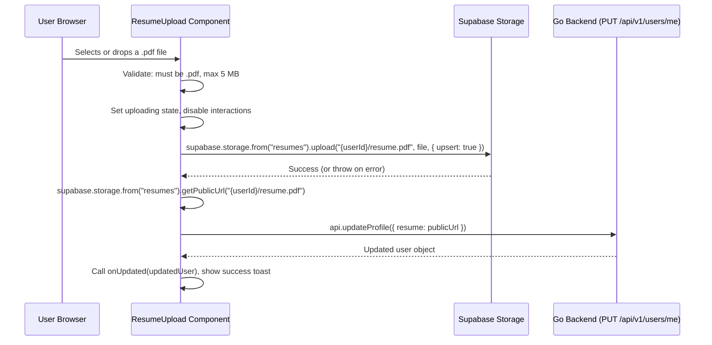

# Resume Upload via Supabase Storage

## Current State

- The `User` model already has a `resume` field (nullable string URL) in both the Go backend ([db/models.go](db/models.go)) and TypeScript types ([ui/types/index.ts](ui/types/index.ts))
- The `PUT /api/v1/users/me` endpoint already accepts `resume` as a URL string
- The profile form ([ui/components/settings/profile-form.tsx](ui/components/settings/profile-form.tsx)) currently has a plain text input for "Resume URL" (line 120-125)
- Supabase client is already configured at [ui/lib/supabase/client.ts](ui/lib/supabase/client.ts) using `@supabase/ssr`
- No Supabase Storage usage exists yet in the project

## Architecture: Client-Side Direct Upload

The browser uploads directly to Supabase Storage using the JS client. The file never touches our Go backend -- it only receives the resulting public URL. This works because we already have Supabase auth sessions on the client, and RLS policies enforce per-user access.



## Step 1: Create Supabase Storage Bucket + RLS Policies

Run these SQL statements in the Supabase Dashboard SQL editor (only once, not in code):

```sql
-- Create a public bucket for resumes
INSERT INTO storage.buckets (id, name, public)
VALUES ('resumes', 'resumes', true);

-- Allow authenticated users to upload to their own folder
CREATE POLICY "Users can upload their own resume"
ON storage.objects FOR INSERT TO authenticated
WITH CHECK (
  bucket_id = 'resumes'
  AND (storage.foldername(name))[1] = (SELECT auth.jwt()->>'sub')
);

-- Allow authenticated users to update/overwrite their own resume
CREATE POLICY "Users can update their own resume"
ON storage.objects FOR UPDATE TO authenticated
USING (
  bucket_id = 'resumes'
  AND (storage.foldername(name))[1] = (SELECT auth.jwt()->>'sub')
);

-- Allow authenticated users to delete their own resume
CREATE POLICY "Users can delete their own resume"
ON storage.objects FOR DELETE TO authenticated
USING (
  bucket_id = 'resumes'
  AND (storage.foldername(name))[1] = (SELECT auth.jwt()->>'sub')
);

-- Allow public read access (since bucket is public, this enables getPublicUrl)
CREATE POLICY "Public read access for resumes"
ON storage.objects FOR SELECT TO public
USING (bucket_id = 'resumes');
```

The file path convention is: `resumes/{user_id}/resume.pdf`. Using `upsert: true` on upload means each user only ever has one resume file, and re-uploading overwrites it.

## Step 2: Add Storage Upload Helper — `ui/lib/storage.ts`

A thin wrapper around Supabase Storage calls. Keeps the component clean.

```typescript
import { createClient } from "@/lib/supabase/client";

const BUCKET = "resumes";
const MAX_FILE_SIZE = 5 * 1024 * 1024; // 5 MB

/**
 * Validates the file before upload.
 * Throws a user-friendly Error if invalid.
 */
export function validateResumeFile(file: File): void {
  if (file.type !== "application/pdf") {
    throw new Error("Only PDF files are allowed.");
  }
  if (file.size > MAX_FILE_SIZE) {
    throw new Error("File size must be under 5 MB.");
  }
}

/**
 * Uploads a resume PDF to Supabase Storage and returns the public URL.
 *
 * - Path: {userId}/resume.pdf (one file per user, upsert overwrites)
 * - Requires the user to have an active Supabase auth session
 * - Caller should validate the file first with validateResumeFile()
 */
export async function uploadResume(userId: string, file: File): Promise<string> {
  const supabase = createClient();
  const filePath = `${userId}/resume.pdf`;

  const { error } = await supabase.storage
    .from(BUCKET)
    .upload(filePath, file, {
      upsert: true,
      contentType: "application/pdf",
    });

  if (error) throw new Error(`Upload failed: ${error.message}`);

  const { data } = supabase.storage.from(BUCKET).getPublicUrl(filePath);
  return data.publicUrl;
}

/**
 * Deletes the user's resume from Supabase Storage.
 */
export async function deleteResume(userId: string): Promise<void> {
  const supabase = createClient();
  const { error } = await supabase.storage
    .from(BUCKET)
    .remove([`${userId}/resume.pdf`]);

  if (error) throw new Error(`Delete failed: ${error.message}`);
}
```

## Step 3: Create `ResumeUpload` Component — `ui/components/settings/resume-upload.tsx`

A self-contained `"use client"` component. Renders as its own `Card` (matching the existing settings card style) below the `ProfileForm`.

### Props

```typescript
interface ResumeUploadProps {
  user: FullUser;
  onUpdated: (user: FullUser) => void;
}
```

These are the same props `ProfileForm` receives, so the parent `SettingsPage` can pass them identically.

### State

```typescript
const [isUploading, setIsUploading] = useState(false);
const [isDeleting, setIsDeleting] = useState(false);
const fileInputRef = useRef<HTMLInputElement>(null);
```

### Component Structure

```
Card (shadow-sm, matching ProfileForm)
├── CardHeader
│   └── CardTitle: "Resume"
└── CardContent
    ├── IF user.resume exists:
    │   ├── <div> showing the current resume:
    │   │   ├── FileText icon + "resume.pdf" text (linked to user.resume, opens in new tab)
    │   │   └── Two buttons:
    │   │       ├── "Replace" button (outline variant) → triggers fileInputRef.click()
    │   │       └── "Remove" button (outline/destructive variant) → calls handleDelete()
    │   └── hidden <input type="file" ref={fileInputRef} accept=".pdf" onChange={handleFileSelect} />
    │
    └── IF user.resume is null:
        ├── A drop-zone style <label> area:
        │   ├── Upload icon + "Click to upload or drag and drop"
        │   ├── "PDF only, max 5 MB" helper text
        │   └── hidden <input type="file" accept=".pdf" onChange={handleFileSelect} />
        │
        └── (OR) Simple button approach:
            ├── Button (outline): "Upload Resume"
            └── hidden <input type="file" ...same />
```

### Handler Logic (exact flow)

**`handleFileSelect(e: ChangeEvent<HTMLInputElement>)`:**

```typescript
async function handleFileSelect(e: React.ChangeEvent<HTMLInputElement>) {
  const file = e.target.files?.[0];
  if (!file) return;

  // 1. Validate
  try {
    validateResumeFile(file);
  } catch (err) {
    toast.error(err instanceof Error ? err.message : "Invalid file.");
    return;
  }

  // 2. Upload to Supabase Storage
  setIsUploading(true);
  try {
    const publicUrl = await uploadResume(user.id, file);

    // 3. Persist URL to Go backend
    const updated = await api.updateProfile({ resume: publicUrl });
    toast.success("Resume uploaded.");
    onUpdated({ ...user, ...updated });
  } catch (err) {
    toast.error(err instanceof Error ? err.message : "Upload failed.");
  } finally {
    setIsUploading(false);
    // Reset the input so the same file can be re-selected
    if (fileInputRef.current) fileInputRef.current.value = "";
  }
}
```

**`handleDelete()`:**

```typescript
async function handleDelete() {
  setIsDeleting(true);
  try {
    // 1. Remove file from Supabase Storage
    await deleteResume(user.id);

    // 2. Clear the URL on the Go backend
    const updated = await api.updateProfile({ resume: "" });
    toast.success("Resume removed.");
    onUpdated({ ...user, ...updated });
  } catch (err) {
    toast.error(err instanceof Error ? err.message : "Failed to remove resume.");
  } finally {
    setIsDeleting(false);
  }
}
```

### Imports Needed

```typescript
"use client"

import { useRef, useState } from "react";
import { toast } from "sonner";
import { FileText, Upload, Trash2 } from "lucide-react";

import type { FullUser } from "@/types";
import { api } from "@/lib/api";
import { uploadResume, deleteResume, validateResumeFile } from "@/lib/storage";
import { Button } from "@/components/ui/button";
import { Card, CardContent, CardHeader, CardTitle } from "@/components/ui/card";
```

All of these packages (`sonner`, `lucide-react`, `@/components/ui/*`) are already used elsewhere in the project -- no new dependencies.

## Step 4: Wire Into Settings Page

### 4a. Remove resume field from `ProfileForm`

In `ui/components/settings/profile-form.tsx`:

1. **Zod schema** — delete the `resume` line:
   ```diff
   - resume: z.string().url("Enter a valid resume URL.").optional().or(z.literal("")),
   ```

2. **Default values** — delete from both `useForm({ defaultValues })` and the `useEffect` reset:
   ```diff
   - resume: user.resume ?? "",
   ```

3. **Submit handler** — delete `resume` from the `api.updateProfile()` call:
   ```diff
   - resume: values.resume,
   ```

4. **JSX** — delete the entire "Resume URL" input block (current lines 120-126):
   ```diff
   - <div className="space-y-2">
   -   <Label htmlFor="resume">Resume URL</Label>
   -   <Input id="resume" {...form.register("resume")} />
   -   {form.formState.errors.resume ? (
   -     <p className="text-xs text-destructive">{form.formState.errors.resume.message}</p>
   -   ) : null}
   - </div>
   ```

### 4b. Add `ResumeUpload` to the settings page

In `ui/components/settings/settings-page.tsx`, render the new component below `ProfileForm` inside the "profile" tab:

```diff
+ import { ResumeUpload } from "@/components/settings/resume-upload"

  <TabsContent value="profile">
    <ProfileForm user={user} onUpdated={setUser} />
+   <div className="mt-6">
+     <ResumeUpload user={user} onUpdated={setUser} />
+   </div>
  </TabsContent>
```

This keeps resume upload visually grouped with the profile tab, but as a separate card so the concerns stay cleanly separated. The `ResumeUpload` card will appear directly below the Profile card.

## No Backend Changes Needed

The Go backend already stores `resume` as a nullable URL string and the `PUT /api/v1/users/me` endpoint accepts it -- no backend modifications are required. The only change is that instead of the user manually pasting a URL, the frontend will upload the file to Supabase Storage and automatically generate and save the public URL.

## Summary of Files Changed / Created

| File | Action |
|------|--------|
| `ui/lib/storage.ts` | **Create** — `uploadResume()`, `deleteResume()`, `validateResumeFile()` |
| `ui/components/settings/resume-upload.tsx` | **Create** — `ResumeUpload` component |
| `ui/components/settings/profile-form.tsx` | **Edit** — remove `resume` field from schema, defaults, submit, and JSX |
| `ui/components/settings/settings-page.tsx` | **Edit** — import and render `ResumeUpload` below `ProfileForm` |
| Supabase SQL editor | **Run once** — create bucket + 4 RLS policies |
